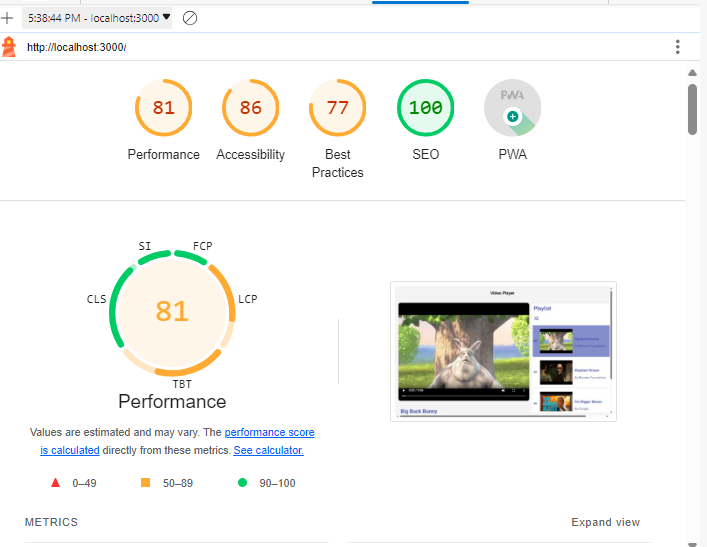

# Video Player App

A Video player app build using react, typescript, css


## Running Locally

1. Clone the repository: 
```bash
  git clone https://github.com/murkishashank/video-player-app.git
  and
  cd video-player-app
```

2. Install dependencies: 
```bash
  yarn
```

3. Start the development server: 
```bash
  yarn start
```
4. Open the project at http://localhost:3000/ in your browser.
    

## Tech Stack

- React.js
- Typescript
- CSS


## Features

#### Video Player
  - Play/Pause toggle.
  - Seek functionality.
  - Timer displaying current playback time and duration.
  - Autoplay.
  - Speed selector for playback speed adjustment.
#### Playlist
  - Reordering videos in the playlist

## LightHouse Score

